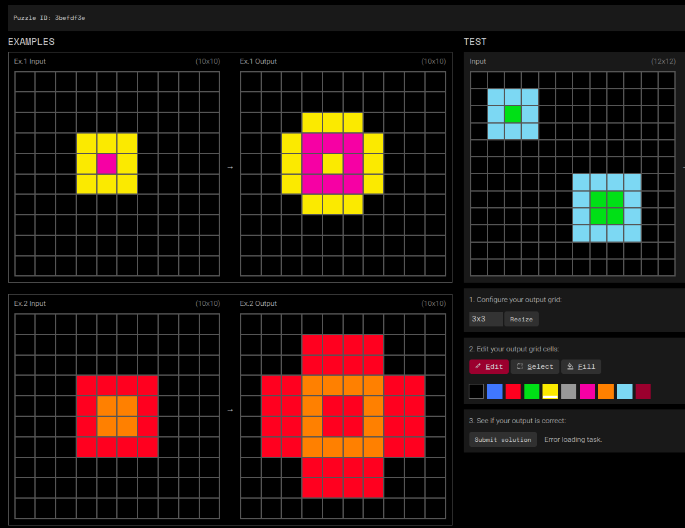
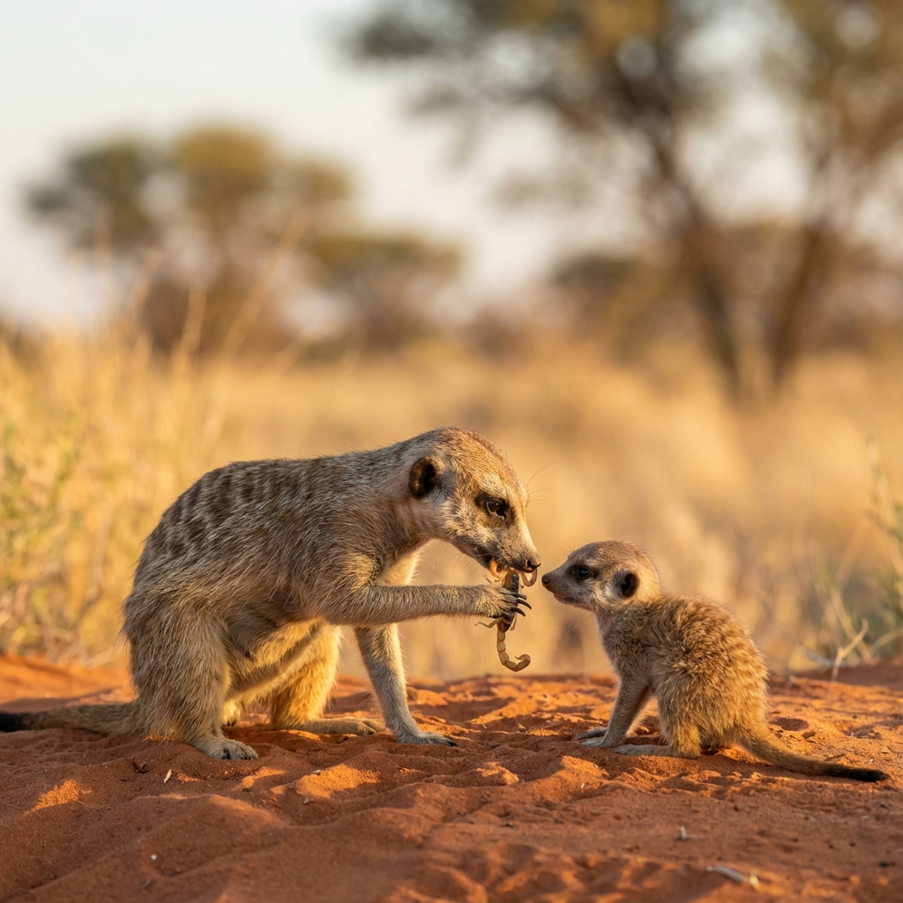
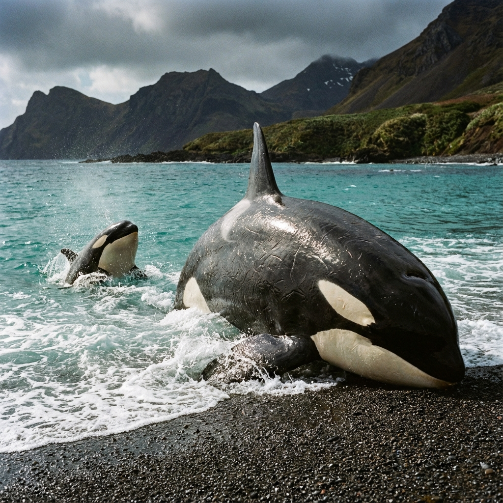

# The Feral Benchmark: Why ARC AGI Fails Biological Plausibility

**End of year 2025 thoughts**

The Abstraction and Reasoning Corpus (ARC-AGI) is widely considered the "final boss" of current AI benchmarks. It presents a system with a few examples of a visual transformation and asks it to deduce the underlying rule to solve a test case. The premise is elegant: it tests for "fluid intelligence" and the ability to adapt to novel situations using only "core knowledge priors" (object permanence, symmetry, etc.), stripping away the rote memorization that allows Large Language Models to cheat on other tests.

https://arcprize.org/arc-agi

However, ARC-AGI contains a hidden, critical flaw. It implicitly assumes that "general intelligence" is a solitary activity: the idea that a "baby AGI" should be able to deduce complex abstractions entirely on its own, given just a few finished examples.

**This assumption is biologically false.** Nature does not produce "feral geniuses." In fact, the most intelligent biological systems are those that rely most heavily on a mechanism ARC ignores entirely: **Parental Teaching and Scaffolding.**

## Innate vs. Taught: The Pre-cocial Trap

ARC-AGI assumes AI should be "born" ready to reason, much like a **precocial** animal.

*   **The Precocial Deer**: A baby deer can stand and walk within minutes of birth. These skills are "hardcoded" or innate. They are impressive, but rigid. A deer doesn't need to reason about gravity or biomechanics; it just executes a program.

*   **The Altricial Human**: A human baby is helpless. Swiss zoologist **Adolf Portmann** termed this "secondary altriciality." Unlike other primates, human infants are born in a state of extreme functional immaturity, effectively finishing their development in a "social womb" of parental care. We cannot walk, hunt, or speak at birth. Yet, we are the species that builds spaceships.

Why? Because our intelligence is not hardcoded; it is **scaffolded**. We trade immediate competence for long-term adaptability. ARC-AGI tries to test for the latter (fluid intelligence) but demands the immediate competence of the former (solving complex tasks from scratch). It expects an altricial mind to perform like a precocial one.

## The Myth of the Solitary Solver

ARC-AGI positions itself as a test of what a human could solve without specific training. But human intelligence is not a product of isolation. It is the result of a massive, multi-decade "context window" filled with active teaching, scaffolding, and social guidance.

When we look at the natural world, we see that the acquisition of complex skills, those requiring true "fluid intelligence," is rarely a solo endeavor.

### 1. The Meerkat Academy: A Curriculum of Scorpions

Meerkats (*Suricata suricatta*) live in harsh environments where their prey (scorpions) are deadly. If a meerkat pup were left to "figure out" a scorpion (the ARC approach: "Here is a scorpion, here is you, solve it"), it would die.

Instead, meerkats engage in active **parental teaching**. Research shows a clear pedagogical curriculum:
1.  **Dead Prey**: First, helpers provide pups with dead scorpions. The "solution" is fully provided; the task is merely consumption.
2.  **Injured Prey**: Next, helpers bite the sting off a live scorpion and present it. The task is now partial: the danger is removed, but the prey still moves. The pup effectively receives a "partial solution."
3.  **Live Prey**: Finally, only when the pup has mastered the partial task, is it presented with the full, unmodified challenge.

### 2. The Orca's Dangerous Game

Killer whales (*Orcinus orca*) in the Crozet Islands practice "intentional stranding," which is the high-risk maneuver of launching themselves onto beaches to catch seals. A mistake here means death by drying out on the sand.

Mothers do not let calves learn this by trial and error. They engage in **active coaching**:
*   Mothers push their calves up the beach to the water's edge, letting them feel the sand without the risk of getting stuck.
*   If a calf strands itself too far, the mother will create waves or physically pull it back to safety.
*   They demonstrate the technique repeatedly, often releasing the prey so the calf can practice the "final step" of the hunt.

This is not self-learning; it is **supervised fine-tuning** in the wild.

### 3. The Feline Hunting School

Cheetahs and domestic cats bring home live prey and release it in front of kittens. They create a "sandbox environment" where fines for failure are lowered. They intervene if the prey is about to escape, resetting the puzzle so the learner can try again.

## The Tragedy of the Feral Child

If ARC-AGI were a valid test of raw, innate biological intelligence, then a human raised in isolation, such as a "feral child," should perform reasonably well on it. After all, they possess the same "core knowledge priors" as any other human.

The reality is tragic. Cases like **Genie** show that without social scaffolding, human intelligence does not spontaneously bloom. Feral children often suffer from profound deficits in abstract reasoning. This proves that our intelligence is not just in our hardware; it is in our **software update stream**: the constant, guided interaction with parents who break down the world for us.

## The Critique: ARC AGI Expects a Miracle

ARC-AGI asks an AI to solve problems that require multiple leaps of logic (e.g., "detect object, rotate it, fill background, but only if blue").

In a biological setting, a parent would never present such a task all at once. They would:
1.  Show the object.
2.  Show the object constructed.
3.  Show the object rotated.
4.  Combine the steps.

By presenting only the start and end state, ARC-AGI is simulating a world where parents do not exist. It tests for a specific type of cryptographic puzzle-solving ability, not the messy, cumulative, socially-scaffolded learning that defines biological AGI.

## The Proposal: A Scaffolded ARC

To truly move towards "Baby AGI," we should modify the ARC challenge:
*   **Gradual Disclosure**: Instead of `Input -> Output`, provide `Input -> Step 1 -> Step 2 -> Output`.
*   **Partial Solutions**: Provide tasks where the agent must only complete the final 10% of the transformation (backward chaining).
*   **Intervention**: Allow the agent to query a "parent" model for a simplified version of the current task.

If we want to build a mind that learns like a baby, we must treat it like one. That means assuming it needs a parent, not just a puzzle.

## Application to the 3 ARC Versions

Our proposed "Scaffolded Approach" is not a one-size-fits-all fix. It applies differently across the evolving ecosystem of the ARC Challenge:

### 1. ARC-AGI-1: The Training Ground (Primary School)
ARC-AGI-1 is the foundational dataset. Typically, AI models treat this as a flat list of `Input -> Output` pairs. This is akin to showing a child a math problem and then the answer, without showing the working out.
*   **The Fix**: We must **re-annotate ARC-AGI-1** to include "parental traces." Every training task should be decomposed into 3-5 sub-steps.
*   **The Goal**: The AI should not just learn to solve the task; it should learn to *predict the decomposition* demonstrated by the "parent" (the annotated data). This builds the "inner speech" of reasoning.

### 2. ARC-AGI-Pub: The Final Exam (High School)
The Public Evaluation Set (ARC-AGI-Pub) tests the model's ability to generalize. Here, the "parent" must step back.
*   **The Fix**: The model receives **no scaffolding** at test time. However, it is expected to use the "internalized parent" it acquired from ARC-AGI-1.
*   **The Mechanism**: The model should generate its own "silent thoughts" (intermediate grids) before producing the final answer, effectively scaffolding itself using the patterns it learned during the "parental" phase.

### 3. ARC-AGI-2: The University Level
ARC-AGI-2 (released 2025) introduces harder, concept-heavy tasks designed to break brute-force solvers. It requires understanding abstract concepts like "gravity," "containment," or "pathfinding" in novel combinations.
*   **The Fix**: Visual scaffolding is not enough here. We need **Concept Scaffolding**.
*   **The Method**: Instead of just showing intermediate grids, the "parent" provides **symbolic hints** (e.g., "Think about gravity first," or "Find the container"). This mimics how a professor teaches advanced physics: not by moving the student's hand, but by guiding their mental model.

## References

1.  **Meerkats**: [Thornton, A., & McAuliffe, K. (2006). Teaching in wild meerkats. *Science*.](https://www.science.org/doi/10.1126/science.1128727)
2.  **Killer Whales**: [Guinet, C., & Bouvier, J. (1995). Development of intentional stranding hunting techniques in killer whale calves at Crozet Archipelago. *Canadian Journal of Zoology*.](https://cdnsciencepub.com/doi/abs/10.1139/z95-004)
3.  **Precocial vs Altricial**: [Portmann, A. (1944). Biologische Fragestellungen zu Problemen der menschlichen Stammesgeschichte. *Phanos*. (Coined the term "Secondary Altriciality")](https://www.researchgate.net/publication/354427834_Portmann_Goethe_and_Modern_Biology_Two_and_a_Half_Ways_of_Looking_at_Nature)
4.  **Feral Children**: [Curtiss, S. (1977). Genie: A Psycholinguistic Study of a Modern-Day "Wild Child". *Academic Press*.](https://www.sciencedirect.com/book/9780121963507/genie)

